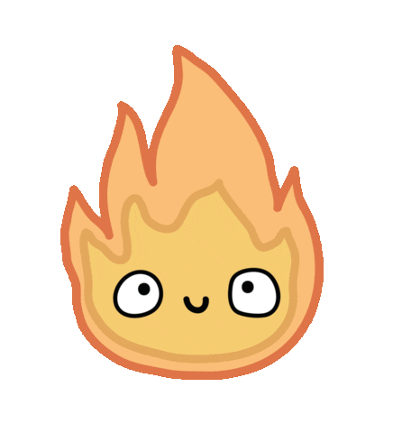
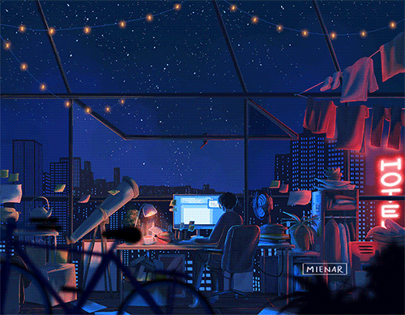

<!--- nice to meet you-->

<!--- Cat logo center-->

    

<h2 align="center"> Self-taught, curious, and passionate about coding!</h2>

* 🌳 I’m currently learning Hardware & Software!   
Actively Going through:
  - firmware extraction
  - modified custom rom
  - keep learning   

* 🐾 2023 Goals: Contribute more to Open Source projects   

* ☕ Interest: Cats, Coffee, and Coding.   

* :octocat: Hobbies:  Anime/Manga,Game,Read.   

<h2></h2> 

 
   

  <h2> <strong> Actively Learning </strong></h2>
  
  
  
  

  <h2> <strong> Social Media ClickME! </strong></h2>
  
  
  
    

 
    

  <h2> <strong> My Github Stats </strong> 
  &nbsp;
   
   

    

  

  

  <h3 align="center">Connect With Me</h3>

   &nbsp;&nbsp;
  
   &nbsp;&nbsp;
  
   &nbsp;&nbsp;

   &nbsp;&nbsp;
  <a>

 
